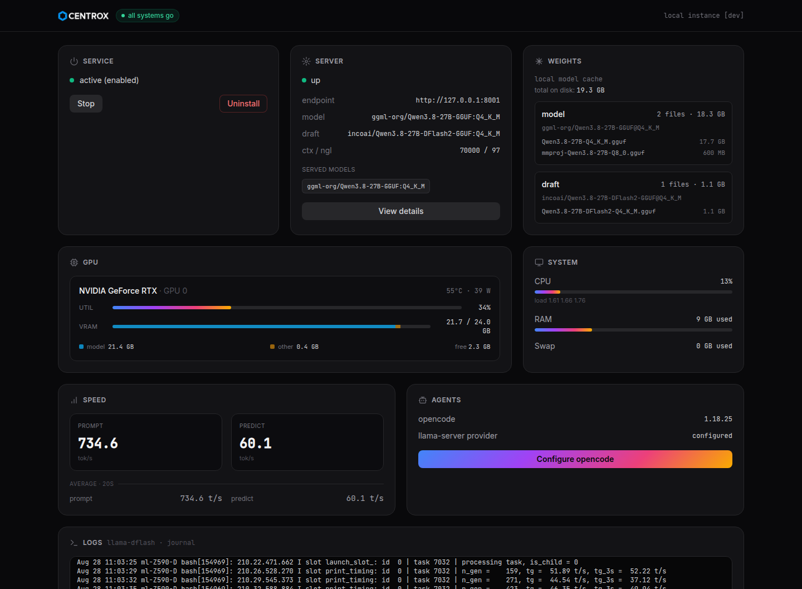

# llama-cpp-dflash2



Local llama.cpp server with DFlash2 speculative decoding running Qwen3.8-27B (Q4_K_M), managed as a systemd user service and wired into opencode as a local model provider.

## Quick start (localllm)

```bash
uv tool install https://github.com/HarrisDePerceptron/llama-cpp-dflash2-qwen3.8
localllm web open
```

This opens a web UI at `http://127.0.0.1:8002` with one-click setup (clone + build),
opencode wiring, service start/stop, live logs, system/GPU stats, and uninstall.
The stack is cloned to `~/.local/share/localllm` on first run.

```bash
localllm web status    # show web UI status
localllm web stop      # stop the background web UI
localllm web serve     # run the web UI in the foreground
```

## Layout

```
.
├── llama.cpp/           # nested git repo (not a submodule), branch pr-27342
├── run.sh               # starts llama-server (port 8001)
├── service.sh           # systemd user-service manager
├── setup.sh             # clone + build llama.cpp
├── setup-opencode.sh    # install opencode + register local provider
├── localllm/            # CLI (uv project, `localllm` command)
└── web/                 # FastAPI web UI (port 8002)
```

## Rebuilding

If you move the repo or change branches, delete `llama.cpp/build/` and re-run `./setup.sh`.

## Uninstall

```bash
./service.sh remove
rm -rf llama.cpp/
```

Or use the **Uninstall** button in the web UI, which also removes the `llama-server`
provider from `~/.config/opencode/opencode.json` (the opencode binary is kept).

## Development

Inside a checkout of this repo, `uv run localllm` uses the checkout itself as the
instance (no clone, reuses the existing build):

```bash
uv sync
uv run localllm web open
```
